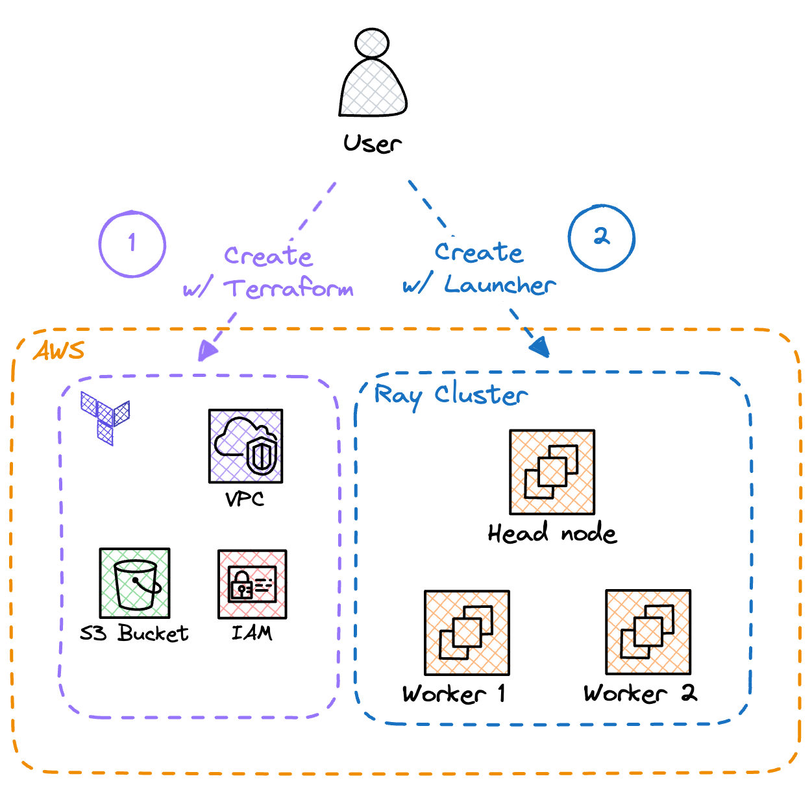

# Ray Framework Demo

Small project developed to play around with [Ray Framework](https://www.ray.io/) and learning the basics.

This is not a production-ready setup! We spin up a Ray Cluster in AWS and then submit a few jobs 
to play with Ray Core, Ray Data and Ray Train.

## What you need to run the project

### AWS account

Ray is a distributed computing framework. So we need nodes in which Ray can be executed.

In this project, we will spin up a [Ray Cluster](https://docs.ray.io/en/latest/cluster/getting-started.html) on **AWS**. Therefore, **you will need an AWS account**.

> **IMPORTANT NOTE**: the infrastructure set up by default **inccurs in charges**. The setup **my not be free**. An AWS Budget is included in the IaC definitions that you can configure to send alerts via email when a certain threshold is met. For more information about budgets peek [the official docs](https://docs.aws.amazon.com/cost-management/latest/userguide/budgets-managing-costs.html).

#### AWS EC2 AMIs

We will spin up some EC2 instances that will act as Head or Worker nodes. In this demo, I set up a Head node with an instance type **without** GPU and the worker nodes with an instance type **with** GPU.

In order to fully utilize the resources, I use different AMIs in each instance type. Depending on the account you are working on, you might need to subscribe to the AMIs beforehand:

- For the Head node: [Ubuntu 22.04 LTS - Jammy](https://aws.amazon.com/marketplace/pp/prodview-f2if34z3a4e3i)
- For the Worker nodes: [AWS Deep Learning AMI GPU PyTorch 2.3 (Ubuntu 20.04)](https://aws.amazon.com/releasenotes/aws-deep-learning-ami-gpu-pytorch-2-3-ubuntu-20-04/)

### Terraform

You will need `terraform` installed in your machine to create the cloud resources. Any version `>= 0.12.0` is fine.

#### S3 bucket

Terraform is configured to use an S3 bucket as backend. You need to manually create that bucket first.

### Weights & Biases account

Then, the Ray Train example uses [Weights & Biases](https://wandb.ai/) as model tracking platform. You will need a WandB account and subsequently an API TOKEN so that the workers can log information about the training process.

The token can be set as an environment variable: `WANDB_API_KEY`

## Repo organization

The code is organized as follows:

- `cluster/`: definition of the Ray Cluster
- `notebooks/`: Jupyter notebooks to play interactively with Ray
- `ray_demo/`: root package, includes some scripts that are excecuted as Ray Jobs in the cluster
- `terraform/`: resources declared as IaC
  - `terraform/demo/`: definition of resources that will be used by the Ray Cluster and/or Ray workers, such as IAM instance roles or an S3 bucket.
  - `terraform/networking/`: definition of foundational resources like a VPC, subnets, etc. 
    - You must generate these resources first.

## Local setup

First things first, install the project with Poetry:

```
git clone git@github.com:facupalavecino/ray-demo.git

cd ray-demo/

poetry install
```

## Setting up the Ray Cluster

> **IMPORTANT DISCLAIMER**: the infrastructure described below is **not recommended for production environments**. Several assumptions are made and **it's not safe**. For example, the security groups in front of the EC2 instances have several ports opened to the internet. Make sure you understand what you are creating, proceed at your own risk :)

Even though Ray is capable of starting a cluster in your local machine (great feature btw), my goal with this project is to actually test workloads in a bigger cluster. I chose to spin up the Ray Cluster on AWS EC2 instances.

In order to do that, we will create several AWS resources required to spin up EC2 instances. I'm using Terraform for this.

Once that's ready, we will leverage Ray the creation of the Ray Cluster itself.

Below, you'll find a diagram that illustrates the process:



### Foundational Infra

You'll find 2 folders in `terraform/`: `demo/` and `networking/`.

Start with `networking/`. You will be creating a VPC and some Subnets in which you'll deploy your EC2 instances.

```hcl
cd terraform/networking/

terraform init
terraform plan -out out.tfplan

# If looks good
terraform apply "out.tfplan"
```

Continue with `demo/`. You will be creating an S3 bucket, some IAM policies and instance role and the EC2 security group.

```hcl
cd terraform/demo/

terraform init
terraform plan -out out.tfplan

# If looks good
terraform apply "out.tfplan"
```

### Launch Cluster

Ray can [launch clusters on cloud providers](https://docs.ray.io/en/latest/cluster/vms/getting-started.html#launch-a-cluster-on-a-cloud-provider). We have to provide a *cluster configuration* as a YAML file and Ray takes care of everything.

You'll find the cluster definition in `cluster/ray-cluster.yaml`.

Launching the cluster is simple, you need to configure the AWS creds beforehand. Ray uses boto3 so any auth mechanism supported by them is enough.

Assuming you are at the project's root:

```
export AWS_PROFILE=<your profile>

poetry run ray up cluster/ray-cluster.yaml
```

The command will log the progress towards spinning up the cluster. By default, it will spin up the Head node and 1 worker node.

The cmd ends when the head node is fully functional (the worker might be initializing) and you will see some handy commands to interact with Ray.

Keep in mind that the URLs provided by Ray use the EC2's **internal IP address**, scroll up a lil bit and find the **public IP** so that you can connect to the dashboard from your machine.


# Job Submission

```bash
ray job submit \
    --runtime-env-json='{"working_dir": ".", "pip": ["torch==2.2.2", "torchvision==0.17.2"]}' \
    -- python ray_demo/batch_classification.py
```


ray job submit --working-dir . -- python ray_demo/main.py